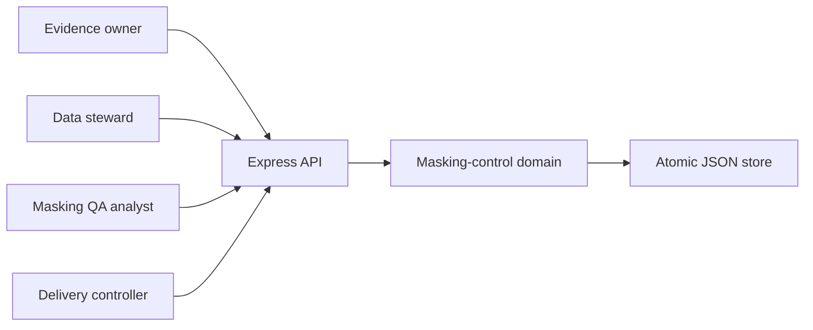
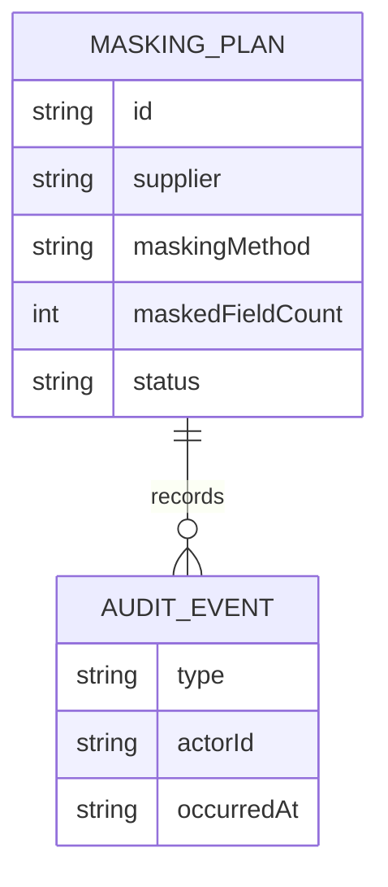
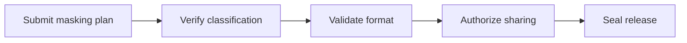
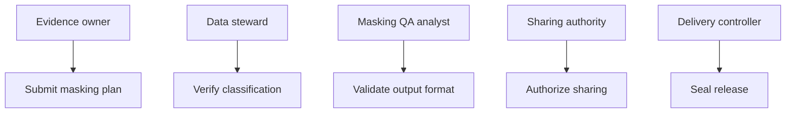
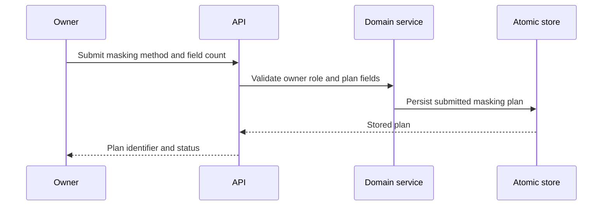

# Supplier Evidence Access Data Masking Control Platform

## The Problem

Supplier evidence may contain operational identifiers, contact records, and commercial fields that a recipient does not need to view. A masking action without classification, output validation, and release sealing leaves teams unable to prove that the shared representation matches its approved purpose.

## The Solution

This service governs data-masking plans from submission through classification verification, format validation, sharing authorization, and release sealing. It validates permissible masking methods and field counts, assigns each control to a distinct role, and records the lifecycle atomically.

## Live Demo and Tech Stack

Run the health endpoint at `http://localhost:65531/health`. The service uses Node.js 22, Express 5, atomic JSON persistence, Vitest, and GitHub Actions.

## Local Setup and Run Instructions

```bash
npm install
npm test
npm start
```

Lifecycle requests require `x-actor-id` and `x-actor-role` headers. The server binds to `0.0.0.0` for controlled LAN use.

## System Documentation

### System Architecture Diagram


### Entity-Relationship Diagram


### Data Flow Diagram


### Use Case Diagram


### Sequence Diagram


## Owner

Created and maintained by Kholipha Ahmmad Al-Amin.

Software Engineer and AI Specialist

Founder and CEO of EquiSaaS BD

Principal Consultant at AR IT Consultancy

Full Stack Developer and SaaS Product Builder

### Official links

Portfolio: https://kholipha-ahmmad-al-amin.equisaas-bd.com/

GitHub: https://github.com/kholipha-ahmmad-al-amin

LinkedIn: https://www.linkedin.com/in/kholipha-ahmmad-al-amin

X: https://x.com/al_amin5519

Facebook: https://www.facebook.com/kholipha.ahmmad.al.amin

Instagram: https://www.instagram.com/kholipha.ahmmad.al.amin

## Ownership

This project was created and is maintained by Kholipha Ahmmad Al-Amin.

